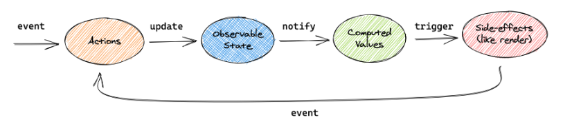

# MobX snippet

## Available Scripts

In the project directory, you can run:

### `npm start`

Runs the app in the development mode.\
Open [http://localhost:3000](http://localhost:3000) to view it in the browser.

The page will reload if you make edits.\
You will also see any lint errors in the console.

## Install required dependencies: 

### `npm install mobx-react` &larr; for class components
### `npm install mobx-react-lite` &larr; for functional components
### `npm install mobx`

## What is mobX?
MobX is a battle-tested library that makes state management simple and scalable by transparently applying functional reactive programming.

The philosophy behind MobX is simple:
1. **Straightforward**. Write minimalistic, boilerplate-free code that
captures your intent. Trying to update a record field? Simply use
a normal JavaScript assignment — the reactivity system will detect
all your changes and propagate them out to where they are being used. 
No special tools are required when updating data in an asynchronous process.
2. **Effortless optimal rendering**. All changes to and uses of your data are tracked
at runtime, building a dependency tree that captures all relations between state and output.
This guarantees that computations that depend on your state, like React components, run only 
when strictly needed. There is no need to manually optimize components with error-prone and 
sub-optimal techniques like memoization and selectors.
3. **Architectural freedom**. MobX is unopinionated and allows you to manage your application
state outside of any UI framework. This makes your code decoupled, portable, and above all, 
easily testable.

Changes in the observable state are propagated precisely to all computations and side effects 
that depend on the changes being made.



This conceptual picture can be applied to any application using MobX.

## Practical examples

Create `store` folder. Here we will store all logic according to **mobX**. Setup structure
of our store and create following folders: 
- `context` - here we will work with context and provider to our store.
- `entities` - here we will store of our entities of store.
- `hooks` - here we will store all hook, which works with our store.

As well create `index.ts` and `store.ts` to export all needed tools and create store accordingly.

First of all we need to create a `rootStore` to collect all our `entities` in one place:

```typescript
import {CounterStore} from "../counter";
import {TodoStore} from "../todo";

export class RootStore {
    counter: CounterStore
    todo: TodoStore

    constructor() {
        this.counter = new CounterStore(this)
        this.todo = new TodoStore(this)
    }

    init = () => {
        //init func
    }
}
```

To access to our `rootStore` we will create a hooke `useStore`:

```typescript
import { useContext } from 'react';

import { Context } from '../context';
import { RootStore } from '../entities/root';

export const useStore = (): RootStore => {
    const rootStore = useContext(Context);

    if (!rootStore) {
        throw new Error('useStore must be used within a StoreProvider');
    }

    return rootStore;
};
```

Create `counter.store.ts` in `entities` folder and export an instance of `CounterStore` class from `index.ts`
in the same folder: 

```typescript
export class CounterStore {

}
```

Constructor is required in this class, so let's add it:

```typescript
class CounterStore {
    constructor() {
        makeAutoObservable(this)
        /*makeObservable({
            value: observable, <- if it is a value
            double: computed, <- if it is a computed value
            increment: action, <- if it is an action
            fetch: flow <- if it is a flow
        })*/
    }
}
```

- `makeObservable` makes this class observable with special config.
- `makeAutoObservable` accepts context of current class and automatically configures
our class.

In our class we create variables, that would be our state: 

```typescript
class CounterStore {
    count: number = 0
    constructor() {
        makeAutoObservable(this)
    }
}
```

Every created method here would be an `action`, which will mutate this state. In compare
with redux state in mobx is mutable. So, if we just change one of variables in state, mobx
will notice it and will rerender our component: 

```typescript
export class CounterStore {
    count: number = 0
    constructor() {
        makeAutoObservable(this)
    }

    increment() {
        this.count += 1
    }

    decrement() {
        this.count -= 1
    }
}
```
 
Now let's move to our counter `component`. To make our component observable we have to wrap it
in `observer` function. Now if state changes, our component would rerender.

Let's investigate how to work with objects and async code in mobx.

Create todo class.

```typescript
import {makeAutoObservable} from "mobx";

export interface TodoItem {
    id: number;
    title: string;
    completed: boolean
}

export class TodoStore {
    todos: TodoItem[] = [
        {id: 1, title: 'Title 1', completed: false},
        {id: 2, title: 'Title 2', completed: false},
        {id: 3, title: 'Title 3', completed: false},
    ]

    constructor() {
        makeAutoObservable(this)
    }

    addTodo(todo: TodoItem) {
        this.todos.push(todo)
    }

    removeTodo(todo: TodoItem) {
        this.todos = this.todos.filter(todoItem => todoItem.id !== todo.id)
    }

    toggleCompleteTodo(todo: TodoItem) {
        this.todos = this.todos.map(todoItem => todoItem.id === todo.id ? {...todoItem, completed: !todoItem.completed} : todoItem)
    }
}
```

When we render this list of our todo it's better to make in additional components, because 
mobx needs to observe only this list, not the whole component. Also use correct
keys in list, to make mobx work correctly.

Ok, now lets change the interface of todo to more complicated: 

```typescript
import {makeAutoObservable} from "mobx";

export interface TodoItem {
    id: number;
    title: TodoTitle;
    completed: boolean
}

export interface TodoTitle {
    id: number;
    value: string
}

export class TodoStore {
    todos: TodoItem[] = [
        {id: 1, title: {id: 1, value:'Title 1'}, completed: false},
        {id: 2, title: {id: 2, value:'Title 2'}, completed: false},
        {id: 3, title: {id: 3, value:'Title 3'}, completed: false},
    ]

    constructor() {
        makeAutoObservable(this, {}, {deep: true})
    }

    addTodo(todo: TodoItem) {
        this.todos.push(todo)
    }

    removeTodo(todo: TodoItem) {
        this.todos = this.todos.filter(todoItem => todoItem.id !== todo.id)
    }

    toggleCompleteTodo(todo: TodoItem) {
        this.todos = this.todos.map(todoItem => todoItem.id === todo.id ? {...todoItem, completed: !todoItem.completed} : todoItem)
    }
}
```

In this case we need to modify our `makeAutoObservable` method:
- Add second parameter to manually configure your properties and methods in class.
Properties are observable, methods are actions and here method also could be
a computed property. But in `makeAutoObservable` it makes no sense to use it, cause this function makes it automatically. If you
want to detail your store just use `makeObservable` instead.
- Add third parameter to pass options. Here we need to make deep observing,
so make option `deep: true`. Also, here it is prefers to use property `autoBind: true`  to automatically bind a method to 
the correct instance, so that this is always correctly bound inside the function.

## Computed values in mobx

Create timer variable in counter. To create a computed property we just need to mark our method as
`get` method. The sense of it is to return a result of sum calculations. For example,
we add to the string sum of timer and counter. And the advantage of this is that this
function going to call only if one of this parameters would change, aka `useCallback` in react.

```typescript
export class CounterStore {
    rootStore: RootStore
    count: number = 0
    timer: number = 60;
    constructor(rootStore: RootStore) {
        makeAutoObservable(this)

        this.rootStore = rootStore
    }

    increment() {
        this.count += 1
    }

    decrement() {
        this.count -= 1
    }

    get total() {
        return `Count + timer = ${this.count + this.timer}`
    }
}
```

Best practice:

1. They should not have side effects or update other observables.
2. Avoid creating and returning new observables.
3. They should not depend on non-observable values.

## Async actions

The realisation of async actions in mobx is more simple than in redux. Example:

```typescript
export class TodoStore {
    //...

    fetchTodo() {
        fetch('https://jsonplaceholder.typicode.com/todos')
            .then(response => response.json())
            .then(json => {
                this.todos.push(json)
            })
    }
}
```

In mobX we have an ability to work with functions-generators. All we need is to mark this function as 
a `flow` instead of action and make if function generator: 

```typescript
import { flow, makeAutoObservable, flowResult } from "mobx"

class Store {
    githubProjects = []
    state = "pending"

    constructor() {
        makeAutoObservable(this, {
            fetchProjects: flow
        })
    }

    // Note the star, this a generator function!
    *fetchProjects() {
        this.githubProjects = []
        this.state = "pending"
        try {
            // Yield instead of await.
            const projects = yield fetchGithubProjectsSomehow()
            const filteredProjects = somePreprocessing(projects)
            this.state = "done"
            this.githubProjects = filteredProjects
            return projects
        } catch (error) {
            this.state = "error"
        }
    }
}

const store = new Store()
const projects = await flowResult(store.fetchProjects())
```

Main concept is:
1. Instead of async use `function *`.
2. Instead of `await` use `yield`.
3. `makeAutoObservable` will automatically infer generators to be `flows`.

Another neat benefit of flows is that they are cancellable.  The return value of flow is a promise
that resolves with the value that is returned from the generator function in the end. 
The returned promise has an additional `cancel()` method that will interrupt the running 
generator and cancel it. Any try / finally clauses will still be run.

## MobX SSR

If observer is used in server side rendering context make sure to call `enableStaticRendering(true)`, so that observer 
won't subscribe to any observables used, and no GC problems are introduced.

## Observer vs React.memo 

`observer` automatically applies `memo`, so observer components never need to be wrapped in `memo`. `memo` can be applied safely 
to observer components because mutations (deeply) inside the props will be picked up by observer anyway if relevant.

